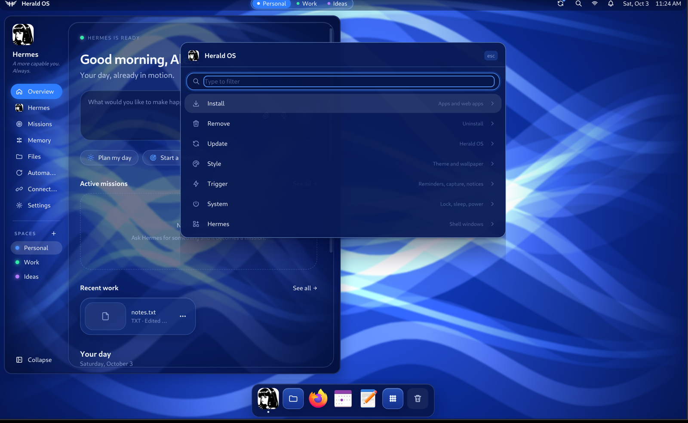

<p align="center">
  
</p>

<h1 align="center">Herald OS</h1>

<p align="center">
  An agent-native operating system, with <a href="https://github.com/NousResearch/hermes-agent">Hermes Agent</a> as the interface.
</p>

<p align="center">
  <a href="https://github.com/iamlukethedev/Herald-OS/releases"></a>
  <a href="https://github.com/iamlukethedev/Herald-OS/actions/workflows/ci.yml"></a>
  <a href="LICENSE"></a>
  <a href="https://discord.gg/RHyFZ7FX6E"></a>
</p>


Herald OS is an operating system built around an AI agent. Instead of working through menus and
folders yourself, you talk or type to Hermes, and it works across the whole machine: it opens apps,
finds and organises files, watches what is running, remembers what matters to you, runs routines on
a schedule, and builds software while you watch. Every action that changes something goes through a
permission system you control.

> [!NOTE]
> **Herald OS is an independent project by [Luke The Dev](https://github.com/iamlukethedev).** It is
> not an official Hermes or Nous Research product, and it is not affiliated with, sponsored by or
> endorsed by Nous Research. Herald OS runs on [Hermes Agent](https://github.com/NousResearch/hermes-agent),
> the open-source agent Nous Research publishes, which is installed alongside it.

> **Status: alpha (0.1).** Expect rough edges, and keep backups of anything you let an agent
> touch.

## Install

Every download is on the [releases page](https://github.com/iamlukethedev/Herald-OS/releases).
Pick the way that matches your machine:

| Your machine | What to install |
| --- | --- |
| A Mac with Apple Silicon | [Herald OS for macOS](#macos) |
| An Intel Mac | [Herald OS Linux in a virtual machine, or the Mac app from source](#on-an-intel-mac) |
| A PC you can give to Herald OS | [The Herald OS Linux installer](#herald-os-linux-on-a-pc) |
| Arch Linux | [The Arch package](#arch-linux) |
| Omarchy | [The Arch package, then one command](#omarchy) |
| Another Linux | [The tarball](#another-linux) |
| An Apple Silicon Mac, to try the whole OS | [The virtual machine](#the-whole-os-in-a-virtual-machine) |

Hermes needs a model provider whichever you pick: a [Nous Portal](https://portal.nousresearch.com)
account, or an API key for a provider Hermes supports (OpenRouter, OpenAI, Anthropic, a local model,
and others). Herald OS shows a sign-in card the first time Hermes needs one.

### macOS

You need macOS 13 (Ventura) or later on Apple Silicon.

**1. Install Hermes Agent** and choose a model, if you don't have it yet:

```bash
curl -fsSL https://hermes-agent.nousresearch.com/install.sh | bash
source ~/.zshrc
hermes setup
```

**2. Install Herald OS.** Download `HeraldOS-<version>-mac-arm64.dmg` from the
[releases page](https://github.com/iamlukethedev/Herald-OS/releases), open it and drag Herald OS to
Applications.

**3. Let it open.** This build is not notarized by Apple yet, so macOS stops it the first time.
Run this once, then open Herald OS from Applications:

```bash
xattr -dr com.apple.quarantine "/Applications/Herald OS.app"
```

Herald OS takes over the screen: `Cmd+Ctrl+F` leaves or re-enters fullscreen and `Cmd+Q` quits. On
its first start it adds its system tools to Hermes (`~/.hermes/plugins/herald-os-bridge`). macOS asks
for each of these the first time a feature needs it:

- **Microphone**: talking to Hermes, dictation, and screen recordings with sound.
- **Camera**: the camera bubble on a screen recording, when you turn it on.
- **Screen Recording**: asking Hermes about the screen, copying text or a QR code from it,
  screenshots and screen recordings.
- **Accessibility and Automation**: typing an emoji or dictation into another app (through System
  Events), and Hermes listing or quitting apps, locking the screen, switching dark mode and moving
  files to the Trash (through Finder).
- **Calendars**: today's events on the Overview.
- **Files and Folders**: your Desktop, Documents and Downloads, for recent files on the Overview,
  the Files page and Hermes's file tools.
- **Notifications**: alerts while you are in another app, in a code-signed build (this release is
  not one yet).

#### On an Intel Mac

There is no Intel build of the Mac app (`npm run dist:mac` builds for Apple Silicon only), and the
ready-made virtual machine (`linux/vm/try.sh`) needs Apple Silicon too. Instead:

- **Herald OS Linux in a virtual machine.** Install the x86_64 installer ISO from
  [Herald OS Linux on a PC](#herald-os-linux-on-a-pc) in a VM that boots with UEFI, such as
  [UTM](https://mac.getutm.app). CI installs it in QEMU with UEFI, 4 cores, 6 GB of memory and a
  40 GB disk ([installer-test.yml](.github/workflows/installer-test.yml)).
- **The Mac app from source** on macOS 13 or later, as in
  [Herald OS on macOS from source](#herald-os-on-macos-from-source). It is untested on Intel, though
  node-pty, its native terminal module, ships Intel binaries.

### Herald OS Linux on a PC

The whole operating system, for a 64-bit Intel or AMD PC: Fedora underneath, everything you see is
Herald.

1. Download both parts of the installer from the
   [releases page](https://github.com/iamlukethedev/Herald-OS/releases),
   `herald-os-<version>-x86_64.iso.part0` and `.part1` (GitHub takes files of up to 2 GB), and join
   them. On macOS or Linux:

   ```bash
   cat herald-os-<version>-x86_64.iso.part* > herald-os-<version>-x86_64.iso
   shasum -a 256 -c herald-os-<version>-x86_64.iso.sha256    # sha256sum -c on Linux
   ```

   On Windows: `copy /b herald-os-<version>-x86_64.iso.part0 + herald-os-<version>-x86_64.iso.part1 herald-os-<version>-x86_64.iso`.
2. Write the ISO to a USB stick of 8 GB or more with
   [Fedora Media Writer](https://fedoraproject.org/workstation/download) or
   [balenaEtcher](https://etcher.balena.io).
3. Start the PC from the stick and follow the installer. Its disk screen lets you erase the disk or
   install next to Windows, and encrypt it. Secure Boot can stay on.
4. The first start sets up Hermes Agent, then Herald OS asks for your name, a password and Wi-Fi.

Updates come as a whole new version of the system: `herald-os update` installs one, and
`herald-os rollback` goes back to the one before. Already on Fedora Silverblue or another bootc
system? It can switch to the Herald OS image in place, which replaces the system you run and adds an
account that signs in without a password: try it on a spare machine or in a virtual machine.
[docs/LINUX.md](docs/LINUX.md#switching-a-bootc-system-to-herald-os) has the steps, what changes and
how to go back.

### Arch Linux

```bash
git clone https://github.com/iamlukethedev/Herald-OS.git
cd Herald-OS/packaging/arch/herald-os-bin
makepkg -si
herald-os setup        # once per user: Hermes Agent and Herald's system tools
```

The package downloads the release build for your architecture (x86_64 or aarch64). Then choose
Herald OS on your login screen for the full session (it needs `niri`; the package's optional
dependencies list what each panel uses), or run `herald-os-app` to use Herald OS as an app inside
your current desktop. The session applies Herald's theme to GTK apps, foot and GNOME's colour
scheme for the account that runs it, so on a desktop you already use, try it from a second account.
The package is not on the AUR yet.

### Omarchy

Install [the Arch package](#arch-linux), then:

```bash
herald-os omarchy install
```

Herald OS becomes an app inside Omarchy. It follows Omarchy's theme and has a row on the Omarchy
menu. `Super+Alt+H` opens it, and `Super+Alt+A`, `C`, `V`, `X`, `E` and `M` ask Hermes about the
window, open the command bar, talk, dictate, pick an emoji and show Missions. `herald-os omarchy
remove` takes it all out again. This has been tested against Omarchy 4's own configuration and
scripts, but not yet on an Omarchy machine: [reports](https://github.com/iamlukethedev/Herald-OS/issues)
are welcome.

### Another Linux

The tarball carries the app, its command-line tools and the full session. Download
`herald-os-<version>-linux-x64.tar.gz` and its `.sha256` from the
[releases page](https://github.com/iamlukethedev/Herald-OS/releases) (the `arm64` ones on ARM), then:

```bash
sha256sum -c herald-os-<version>-linux-x64.tar.gz.sha256
sudo mkdir -p /opt/herald-os
sudo tar -xzf herald-os-<version>-linux-x64.tar.gz -C /opt/herald-os --strip-components=1
sudo /opt/herald-os/resources/herald-os-linux/bin/herald-os-tarball install
herald-os setup        # once per user: Hermes Agent and Herald's system tools
herald-os-app          # Herald OS as an app inside your desktop
```

`herald-os-tarball install` puts the `herald-os` commands in `/usr/local/bin` and Herald OS in your
application menu, and, if niri is installed, on your login screen; `sudo herald-os-tarball remove`
takes them out again. `herald-os update` installs a new release once its checksum matches, and
`herald-os rollback` goes back to the version before.

The full session needs niri and the tools its menu bar and panels use (Fedora's package names are
in [linux/image/packages.txt](linux/image/packages.txt)). It also applies Herald's theme to the
account that runs it: GTK 3 and 4 apps (`gtk.css`), the foot terminal (`foot.ini`) and GNOME's
colour scheme and GTK theme. On a desktop you already use, try it from a second account.
[docs/LINUX.md](docs/LINUX.md#another-linux-the-release-tarball) has the details.

### The whole OS in a virtual machine

On an Apple Silicon Mac, one command downloads the latest release's VM disk (about 2.7 GB) and
boots it with Apple's virtualization, so the graphics are accelerated:

```bash
brew install qemu zstd
git clone https://github.com/iamlukethedev/Herald-OS.git && cd Herald-OS
bash linux/vm/try.sh
```

The first start sets itself up in a few minutes, Hermes Agent included. The disk is also on the
releases page in two parts, `herald-os-<version>-aarch64.qcow2.zst.part0` and `.part1`: join them
with `cat`, unpack with `zstd -d`, and it imports into [UTM](https://mac.getutm.app). To build the VM
from your checkout instead and work on Herald OS Linux, see
[Building from source](#herald-os-linux-in-a-virtual-machine).

## How Herald OS fits together

**Herald OS Linux is the operating system.** Fedora supplies the kernel, drivers and packages, and
everything you see is Herald. The machine boots to the Herald splash screen and signs you straight
in. The niri compositor arranges the windows, Herald draws the menu bar, dock, notifications, app
launcher and system menus, and its theme styles the lock screen. Hermes starts with the session,
with tools to see and operate the machine. Linux apps such as Firefox, LibreOffice and VS Code run
as windows inside it, and a curated set comes preinstalled. It installs on a PC from the installer
image or runs in a virtual machine, and it updates as a whole system you can roll back.

**On Arch Linux and Omarchy,** Herald OS is a package: the full session from the login screen, or
Herald as an app inside Hyprland and Omarchy, following Omarchy's theme and keys.

**Herald OS also runs on a Mac,** fullscreen over macOS: the same interface, agent and tools, with
macOS underneath handling the hardware and your Mac apps. It is the quickest way to try Herald OS,
and where most of it is built.

Herald OS does not fork Hermes. It runs a standard Hermes Agent install and adds its system
abilities as a regular Hermes plugin, `herald-os-bridge`.

## A look around

<table>
  <tr>
    <td width="50%"></td>
    <td width="50%"></td>
  </tr>
  <tr>
    <td>Herald OS Linux boots to its own splash screen and signs you straight in.</td>
    <td>The launcher holds Herald's own apps and every installed Linux app.</td>
  </tr>
  <tr>
    <td width="50%"></td>
    <td width="50%"></td>
  </tr>
  <tr>
    <td>One menu installs apps, changes the theme and updates the system. Hermes can do the same.</td>
    <td>Hermes answers with its system tools and asks before it changes anything.</td>
  </tr>
</table>

## What you get

- **Hermes at the centre.** Overview, Hermes, Missions, Memory, Files, Automations, Connections and
  Settings, plus a Terminal, a System monitor, and floating chat windows.
- **Pick up where you left off.** When you open Herald OS or come back after a break, Hermes looks
  at your recent documents, project folders (with their git state), conversations and today's
  calendar, and puts up to three threads of work on the Overview. Continue reopens a thread's
  conversation, folder and files; its suggested next step starts only when you click it.
- **A command bar** for every action in the OS: open pages and apps, add memories, run automations,
  start missions.
- **System tools for Hermes**: system info, processes, disk usage, file search, opening apps,
  moving and trashing files, and more, each with a permission tier, protected paths, an audit log
  and the standard Hermes approval card. See [docs/SYSTEM-BRIDGE.md](docs/SYSTEM-BRIDGE.md).
- **Voice**: press the voice key or say "hey Hermes" and talk. Hermes answers out loud and can
  operate the interface ("open missions", "remember that my sister's birthday is in May"). A free
  engine works with any speech provider; an opt-in realtime engine is available. See
  [docs/VOICE.md](docs/VOICE.md).
- **Studio**: say "build a website for a hair salon" and watch it happen in one window: the
  project's files, the code as it is written, the commands it runs, and a live preview.
- **Crash help**: when a program crashes, a notification offers to have Hermes read the crash
  report and explain, in plain words, what went wrong and whether it is worth reporting.
- **Herald Canvas**: a layered image editor with masks, blend modes, adjustment layers, layer
  effects and editable text, drawn on the GPU. Remove backgrounds, select objects and fill holes with
  models that run on your computer, open and export Photoshop files, and ask Hermes for a poster or a
  warmer photo while you watch it work. Its projects open in Compositor on the Mac. See
  [the manual](docs/manual/canvas.md).
- **Make it yours**: twelve themes (two light) that also dress Hermes's own command line, a theme
  made from any image, themes installed from git, your own fonts, and Hermes can design one from a
  description. Widgets for the menu bar, the Overview or their own window run sandboxed with only
  the permissions you grant, and Hermes can write them for you. Arrange the menu bar and its clock,
  add your own control-menu entries, and put your logo in About and your picture on the lock
  screen. See [the manual](docs/manual/make-it-yours.md).
- **The screen**: select part of the screen and ask Hermes about it; pick a colour, read a QR code
  or copy the text from anywhere on it; and type an emoji into any app (`Cmd+Ctrl+E` on the Mac,
  `Super+Ctrl+E` on Linux).
- **Usage**: what Hermes used this week and this month, and what is left on your model plan, with
  a warning at 90%.
- **When something happens**: automations that run when you log in, come back after a break, the
  battery runs low or a program crashes, and hook scripts for the same moments.
- **On Herald OS Linux, the rest of an OS**: a control menu to install and remove apps, change the
  theme and update the system; one-click installs for AI tools such as Claude Code, Codex and local
  models; themes that recolour everything from the menu bar to the terminal; Wi-Fi, Bluetooth,
  sound, display and battery panels; screenshots, screen recording, night light and do not disturb;
  web apps in their own windows; clipboard history, a lock screen and a power menu; fingerprint and
  security-key sign-in; a firewall that refuses incoming connections; and one command,
  `herald-os update`, that updates Herald OS, Hermes and Fedora, with `herald-os rollback` to undo
  it.

The [manual](docs/manual/README.md) covers using all of it, with every hotkey and a page for
people coming from macOS.

## Building from source

To work on Herald OS, or to run what is on `main`:

- **Herald OS Linux in a virtual machine** gives you the whole operating system, built from your
  checkout. The first setup takes about half an hour, most of it downloads.
- **Herald OS on macOS** runs from your checkout in a few minutes if you already have Node.js.

### Herald OS Linux in a virtual machine

You need an Apple Silicon Mac with [Homebrew](https://brew.sh) and about 20 GB of free disk space.
The virtual machine gets 4 cores and 8 GB of memory; on a Mac with 8 GB in total, start it with
`MEM=4096` in front of the command. Nothing on the Mac itself changes: the VM is a disk image in
`linux/vm/build/`.

**1. Install QEMU and get the code.**

```bash
brew install qemu
git clone https://github.com/iamlukethedev/Herald-OS.git
cd Herald-OS
```

**2. Download Fedora and prepare the first boot.**

```bash
bash linux/vm/download-image.sh   # Fedora Cloud for ARM, about 500 MB
bash linux/vm/make-seed.sh        # first-boot setup and an SSH key, in linux/vm/build/
```

**3. Boot the virtual machine.** A window opens on your Mac. The first boot installs Herald OS:
the system packages, Hermes Agent and the default apps.

```bash
bash linux/vm/run-qemu.sh
bash linux/vm/run-qemu.sh console   # follow the install; Ctrl+C stops watching
```

Wait until the console prints `==> Provisioning complete`. That takes 30 to 45 minutes, mostly
downloads. If it prints `==> Provisioning FAILED` instead, see [Troubleshooting](#troubleshooting).

**4. Install the Herald shell.** This copies your checkout into the VM, builds it there and starts
Herald OS:

```bash
bash linux/dev/push.sh
```

**5. Sign Hermes in.** The first time Hermes needs a model, Herald OS shows a sign-in card with a
short code: open the link on any device and enter the code. To use an API key or another provider
instead, open a shell in the VM with `bash linux/dev/push.sh ssh` and run `hermes setup`.

From then on, `bash linux/vm/run-qemu.sh stop` shuts the VM down and `bash linux/vm/run-qemu.sh`
starts it again, straight into Herald OS. After you change the code on your Mac,
`bash linux/dev/push.sh` installs it. [docs/LINUX.md](docs/LINUX.md) covers UTM, display scaling on
Retina screens, the session model and the dev loop.

### Herald OS on macOS from source

You need:

- **macOS 13 (Ventura) or later on Apple Silicon.** Intel Macs are untested. Herald OS is
  developed on macOS 26.
- **Node.js 22.12 or later** ([nodejs.org](https://nodejs.org), or `brew install node`).
- **Git**, and the Xcode Command Line Tools (`xcode-select --install`) for native modules.
- **Hermes Agent 0.21.3 or later**, with a model provider set up (step 1 below).

**1. Install Hermes Agent and choose a model.** Herald OS on macOS uses your own Hermes install.
If you don't have it yet:

```bash
curl -fsSL https://hermes-agent.nousresearch.com/install.sh | bash
source ~/.zshrc
hermes setup
```

`hermes setup` walks you through choosing a model provider and signing in. You can change it later
with `hermes model`, or from Herald OS under Settings. Check that Hermes works on its own before
going further:

```bash
hermes doctor
hermes        # say hello, then exit with Ctrl+D
```

**2. Get the code.**

```bash
git clone https://github.com/iamlukethedev/Herald-OS.git
cd Herald-OS
```

**3. Bootstrap.**

```bash
npm run bootstrap
```

This is safe to re-run, and you should re-run it after every `git pull`. It:

1. downloads the pinned Hermes gateway client the shell is compiled against (`upstream/`);
2. installs the Node packages and downloads Electron;
3. links the `herald-os-bridge` plugin into `~/.hermes/plugins` and enables it and its tools;
4. migrates settings from the project's earlier name (Hermes OS), if you had it installed;
5. reports which optional voice packages your Hermes install has.

**4. Start Herald OS.**

```bash
npm run dev
```

Herald OS starts your Hermes runtime in the background (`hermes serve`, on 127.0.0.1 only), shows
the boot screen, and takes over the screen. `Cmd+Ctrl+F` leaves or re-enters fullscreen; `Cmd+Q`
quits and stops the backend it started.

Edits to the interface (`apps/desktop/src`) reload live. Changes to the Electron main process need
a restart (`Ctrl+C`, then `npm run dev` again).

**5. Check that everything works.**

- **Hermes answers.** Open the Hermes page (`Cmd+2`) and ask something. If it asks you to sign in,
  use the card it shows, or run `hermes setup` again.
- **System tools work.** Ask "what is using the most memory right now?". Hermes should answer with
  the `system_processes` tool rather than a shell command. Ask it to move a file and you should get
  an approval card first.
- **Voice works (optional).** Press `Alt+Space` and allow microphone access when macOS asks.
  Settings > Voice has "Say hello" and "Start talking" buttons to test it.

## Using Herald OS

### Keyboard shortcuts

On Herald OS Linux the system key is `Super` (the Windows or Command key), and `Super+K` lists every
shortcut. In the virtual machine the system key is `Alt` (`Option` on a Mac keyboard) instead, so
`Super+A` becomes `Alt+A`: the Mac keeps `Command` for itself. Herald's own pages also answer to
`Ctrl` on Linux, so `Ctrl+K` and `Ctrl+1` work everywhere.

| Action | Herald OS Linux | macOS |
| --- | --- | --- |
| Command bar | `Super+Shift+Space` or `Ctrl+K` | `Cmd+K` |
| All applications | `Super+A` | `Cmd+Shift+A` |
| Talk to Hermes | `Super+V` | `Alt+Space` |
| Ask Hermes about the focused window | `Super+Space` | |
| Herald OS menu: apps, themes, updates | `Super+M` or `Super+Alt+Space` | |
| Overview, Hermes, Missions, Memory, Files, Automations, Connections | `Ctrl+1` ... `Ctrl+7` | `Cmd+1` ... `Cmd+7` |
| Settings | `Super+,` | `Cmd+,` |
| Terminal | `Super+Return` | `Cmd+8` |
| Close window | `Super+Q` | `Cmd+W` |
| Emoji, typed into any app | `Super+Ctrl+E` | `Cmd+Ctrl+E` |
| Clipboard history | `Super+Ctrl+V` | |
| Lock, power menu | `Super+Ctrl+L`, `Super+Escape` | |
| Toggle fullscreen, quit | | `Cmd+Ctrl+F`, `Cmd+Q` |

On Linux, every hotkey and menu item is a `herald-os` command, so Hermes and your scripts can do
the same things: `herald-os install app obsidian`, `herald-os theme set ice`, `herald-os update`.
`herald-os commands` lists them all.

### Permissions

Hermes's system tools have four tiers. `read` tools (system info, file search) and `act` tools
(opening an app) run straight away and are logged. `mutate` tools (create, move, rename) ask first,
and you can allow them for the session or always. `destructive` tools (stopping a process, moving
files to the Trash) ask every time. Some locations, such as `~/.ssh`, your keychains and Hermes's
own credentials, are always refused.

Settings > Privacy shows the policy and the audit log (`~/.hermes/herald-os/audit.jsonl`). Hermes's
own terminal tool keeps following Hermes's approval settings.

Pick up where you left off is off until you turn it on from the Overview. It reads names and dates
(recent files and folders, project branches and commit messages, conversation titles, today's
event titles, open apps), never file contents, window titles or the screen, and sends them to your
Hermes model provider to write the suggestions. Settings > Privacy turns it off and lists folders
and words it must leave out, such as a client's name.

### Settings and data

| What | Where |
| --- | --- |
| Herald OS preferences | `~/.hermes/herald-os/prefs.json` (edit them in Settings) |
| Audit log, control socket | `~/.hermes/herald-os/` |
| Log file | `~/.hermes/logs/herald-os.log` |
| Hermes config, memories, sessions, credentials | `~/.hermes/`, managed by Hermes |

A few options come from environment variables, mostly for development: starting windowed on macOS
(`HERALD_OS_WINDOWED=1`), using a different Hermes checkout (`HERALD_OS_HERMES_ROOT`), or a
throwaway Hermes home (`HERMES_HOME=/tmp/herald-test`). [.env.example](.env.example) lists them
all.

#### What Herald OS changes in your Hermes

Herald OS runs on your own Hermes, so a few of its changes reach Hermes's other sessions too:

- **The system bridge plugin.** Setup (the Mac app's first start, `herald-os setup`, or
  `npm run bootstrap`) links it into `~/.hermes/plugins/herald-os-bridge`, adds it to
  `plugins.enabled`, and saves the `cli` platform's toolset list with `herald_os` in it. Its tools
  run only in sessions Herald OS starts; Telegram, Discord, cron and the `hermes` CLI never get them.
- **Tool search off** (`tools.tool_search.enabled: off`), so Hermes calls the system tools directly.
  Hermes has one switch for every session, so plugin and MCP tools are listed directly everywhere.
  The earlier value is kept in `~/.hermes/herald-os/tool-search-before`, and Settings > Hermes &
  agents > Tool search turns it back on.
- **Your theme** becomes Hermes's skin (`display.skin: herald-os`) unless you picked another one.
- **Voice** switches speech-to-text to `local` or text-to-speech to `edge` (`stt.provider`,
  `tts.provider`) when the provider you had cannot run, and tells you when it does.

To undo it on Linux, run `herald-os setup --undo`. On macOS, the steps are in
[docs/SYSTEM-BRIDGE.md](docs/SYSTEM-BRIDGE.md#what-herald-os-changes-in-your-hermes).

## Building a macOS release

```bash
npm run dist:mac
```

This writes an Apple Silicon DMG and zip to `apps/desktop/release/`. Before installing, know that:

- **A local build is not notarized.** electron-builder signs it with a code-signing identity from
  your keychain if it finds one, and leaves it unsigned otherwise. A copy that was downloaded or sent
  to you will not open the first time: choose Open Anyway in System Settings → Privacy & Security, or
  run `xattr -dr com.apple.quarantine "/Applications/Herald OS.app"`. The release workflow
  (`.github/workflows/release.yml`) builds a signed and notarized one when the repository has the
  `MAC_CERTIFICATE_P12`, `MAC_CERTIFICATE_PASSWORD`, `APPLE_ID`, `APPLE_APP_SPECIFIC_PASSWORD` and
  `APPLE_TEAM_ID` secrets; set the same variables locally (`CSC_LINK` and `CSC_KEY_PASSWORD` for the
  certificate) to notarize from your Mac.
- **macOS notifications need a signed build.** Notifications still appear inside Herald OS, but the
  macOS ones it sends while you are in another app only work when the build is code-signed.
- **The system tools plugin comes with the app.** On its first start the app links its copy into
  `~/.hermes/plugins` and enables it. A link from a checkout (`npm run bootstrap`) stays as it is.
- **Hermes Agent is not bundled.** The app finds it as in development: `HERALD_OS_HERMES_ROOT`,
  then `~/.hermes/hermes-agent`, then `hermes` on your PATH.

## Building a Linux release

```bash
npm run dist:linux --workspace apps/desktop            # this machine's architecture
npm run dist:linux --workspace apps/desktop -- --arm64  # or pick one
```

This writes `herald-os-<version>-linux-<arch>.tar.gz` to `apps/desktop/release/`: the app, with the
`herald-os` CLIs, the niri session, themes, the install catalog and the bridge plugin under
`resources/`. Build on the target architecture (node-pty is compiled, not cross-built); the release
workflow builds x64 and arm64 on matching runners. The tarball is what the Arch package and the
Herald OS image install; on its own, unpack it to `/opt/herald-os` and run
`sudo /opt/herald-os/resources/herald-os-linux/bin/herald-os-tarball install`, as in
[Another Linux](#another-linux).

## Project layout

```
apps/desktop/               The Herald shell: Electron main (electron/), preload/, React interface (src/)
packages/hermes-client/     Typed client for the Hermes gateway (JSON-RPC over WebSocket, REST)
plugins/herald-os-bridge/   Hermes plugin: system tools, permission tiers, audit log, UI control
linux/                      Herald OS Linux: provisioning, session, niri config, themes, apps, VM tooling
examples/widgets/           sample widget plugins (ADR-019)
scripts/                    bootstrap, upstream sync, bridge tests, secret scan
upstream/                   UPSTREAM.lock, the pinned Hermes version the shell builds against
docs/                       architecture, decisions, system bridge, voice, Linux
```

New here? Read [docs/ARCHITECTURE.md](docs/ARCHITECTURE.md), then
[apps/desktop/README.md](apps/desktop/README.md) for where things go in the shell.

## Development

```bash
npm run typecheck     # TypeScript: interface, Electron main and preload, client package
npm test              # Vitest
npm run test:bridge   # pytest for the bridge plugin
npm run build         # production build into apps/desktop/dist
bash scripts/check-secrets.sh   # gitleaks over the history and your changes
```

CI runs all of these on Ubuntu and macOS. [CONTRIBUTING.md](CONTRIBUTING.md) has the conventions.

## Updating

- **Herald OS Linux:** `herald-os update` (or Update in the Herald OS menu) installs the new system,
  Hermes Agent and the Flatpak apps, and `herald-os rollback` goes back.
- **The Mac app:** download the new DMG and replace the app in Applications. `hermes update` updates
  Hermes itself, whenever you like.
- **Arch and Omarchy:** run `git pull` and `makepkg -si` again in `packaging/arch/herald-os-bin`.
- **The tarball on another Linux:** `herald-os update` downloads the newest release for your
  architecture, checks it against its `.sha256` and swaps it into `/opt/herald-os`, keeping the
  version before in `/opt/herald-os.previous` for `herald-os rollback`. Log out and back in to use it.
- **From source on macOS:** `git pull`, then `npm run bootstrap`.
- **The development VM:** `git pull` on the Mac, then `bash linux/dev/push.sh`.

The shell compiles against a pinned Hermes version (`upstream/UPSTREAM.lock`), so updating Hermes
does not change the shell's code. Moving the pin is described in [upstream/README.md](upstream/README.md).

## Troubleshooting

- **"No Hermes runtime found", or the boot screen never finishes.** Run `hermes doctor`. If Hermes
  lives somewhere other than `~/.hermes/hermes-agent` and is not on your PATH, start with
  `HERALD_OS_HERMES_ROOT=/path/to/hermes-agent npm run dev`. The cause is usually in
  `~/.hermes/logs/herald-os.log`.
- **macOS says Herald OS "is damaged" or "cannot be opened".** The build is not notarized yet: run
  `xattr -dr com.apple.quarantine "/Applications/Herald OS.app"` and open it again.
- **Hermes uses shell commands instead of its system tools.** `hermes plugins list` should show
  `herald-os-bridge` as enabled; `hermes plugins enable herald-os-bridge` turns it on. From a
  checkout, re-run `npm run bootstrap`; on Linux, `herald-os setup`. Then restart Herald OS.
- **The VM's first boot fails or never finishes.** A failed step prints
  `==> Provisioning FAILED at line N`, and `bash linux/vm/run-qemu.sh console` shows where it
  stopped. `/var/log/herald-os-provision.log` in the VM has the whole run (`bash linux/dev/push.sh ssh`
  opens a shell there). `bash linux/vm/run-qemu.sh reset` deletes the VM's disk so the next start
  begins again.
- **Herald OS Linux shows a black screen after `push.sh`.** Open a shell with
  `bash linux/dev/push.sh ssh` and read `~/.local/state/herald-os/shell.log` and
  `journalctl -u greetd`.
- **`npm run dev` waits on a download.** Electron downloads itself on first use. Bootstrap does this
  up front; behind a proxy, see [Electron's installation docs](https://www.electronjs.org/docs/latest/tutorial/installation).
- **Native module errors after changing Node versions.** Delete `node_modules` and run
  `npm run bootstrap` again.
- **The microphone does nothing on macOS.** Check System Settings > Privacy & Security >
  Microphone. In development the permission belongs to Electron (or your terminal); in a built
  release, to Herald OS.
- **Stuck fullscreen on macOS.** `Cmd+Ctrl+F`, or start with `HERALD_OS_WINDOWED=1 npm run dev`.
- **Still stuck?** Ask in #help on [Discord](https://discord.gg/RHyFZ7FX6E), or open an issue on
  GitHub.

## Contributing and security

Contributions are welcome: see [CONTRIBUTING.md](CONTRIBUTING.md). Come and ask questions, share
ideas or show what you built on [Discord](https://discord.gg/RHyFZ7FX6E). Please report
vulnerabilities privately, as described in [SECURITY.md](SECURITY.md).

## License

[MIT](LICENSE). Herald OS builds on [Hermes Agent](https://github.com/NousResearch/hermes-agent) by
Nous Research, also MIT; see [NOTICE](NOTICE). Herald OS is an independent project and is not
affiliated with Nous Research; the Hermes names refer to Nous Research's project and are used only
to say what Herald OS runs on.
